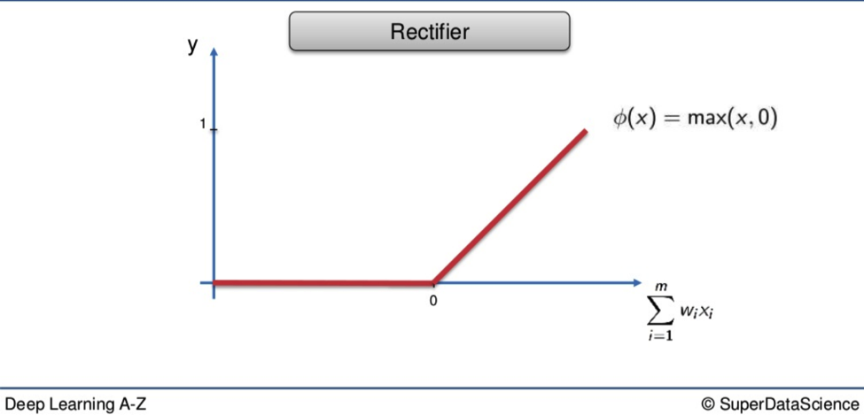
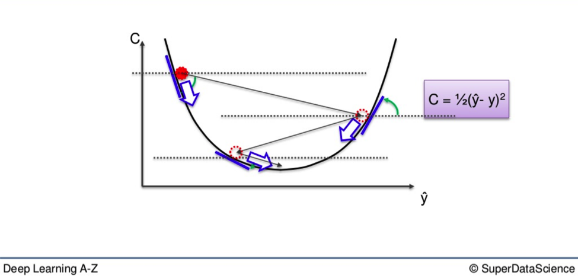

[Source](https://www.superdatascience.com/blogs/the-ultimate-guide-to-artificial-neural-networks-ann) for below notes
# Artificial Neural Networks
- the Neuron
- the Activation Function
- Practical Application
- How Neural Networks Learn
    - Gradient Descent
    - Stochastic Gradient Desent
- Backpropagation

## The Neuron
the neuron that forms the basis of all neural networks is an imitation of what has been observed in the human brain

- the eyeless head is the neuron
- neuron connects to other neurons by tentacles called dendrites and the tails called axons
- electrical signals flow through dendrites and axons
- at the moment a signal is passed between an axon and dendrite, the two don't actually touch
- instead, a gap exists between them 
- to continue on its journey, signal must "jump" across a deep canyon
- jump process / signal passing is called the **synapse**

### How has the biological neuron been reimagined? 

- inputs represent the incoming signals to the main neuron in the middle
- in a human neuron, these would include things like smell and touch
- in a neural network, these are **independent variables**
    - they travel down the synapses, go through the big grey circle, then emerge on the other side as output values
- the main difference is the level of control you exert over the input values 
- you cannot decide whether a screeching sound pierces your ears 
- you CAN determine what the variables will be in your neural network 

#### Important to Remember
- you must either **standardize** the values of your independent variable or **normalize** them
- this keeps your variables within a similar range so its easier for the n.n. to process them
- essential for operational capacity of n.n.

### Observations
- equally important to note that each variable does not stand alone 
- they are together as a singular obs. 
    - you may list a persons height, age, weight. they are different descriptors applying to the same person

### Output values
- output values can be:
    - continuous
    - binary (yes or no)
    - categorical 
- categorical will fan out into multiple variables 
- just as input variables are different parts of a whole, the same goes for categorical input

### Synapse
- each synapse is assigned a weight 
- weights are pivotal factor in n.n. functioning 
- weights are how n.n. learn
- weight determines which signals get passed along or to what extent a signal gets passed along
- later, gradient descent and backpropagation are concepts that apply to alteration of weights: hows, whys, what works best.

- neuron takes all the weights its received and adds them up. 
- then it applies an activation function which facilitates whether a signal gets passed on or not 
- that signal goes to the next neuron down the line, etc etc 

[Additional reading](http://yann.lecun.com/exdb/publis/pdf/lecun-98b.pdf)

## The Activation Function
activation function is the process applied to the weighted input value once it enters the neuron

### Values
- weighted input values are shampoo, floor polish, and gin
- neuron is the deep black pot they're mixed in
- activation function is the open flame beneath that congeals the concoction
- output value is the result

#### The Threshold Function
a yes or no, black or white, binary function

#### The Sigmoid Function
curvature means it is far better suited to probabilities when applied at the output layer of your n.n.
- if the threshold tells you the difference between 0 and 1 dollar, the sigmoid gives you that as well as every cent in between

#### The Rectifier Function
one of the most popular functions applied today
- if a weighted value is below 0, it doesn't get abandoned 
- it is recruited and becomes a 0

#### The Hyperbolic Tangent Function (Tanh)
Tanh is the Dante Inferno of the activation functions
- it is willing to delve deep below the x axis 

[Additional Reading](http://proceedings.mlr.press/v15/glorot11a/glorot11a.pdf)

## How do Neural Networks Work?
we always begin with a layer of input variables 

in this simple example, we have four variables:
- Area (sqft)
- Number of bedrooms
- Distance to the city (miles)
- Age of the property

their values go through the weighted synapses straight over to the output layer. 

### Hidden layer
you can implement a hidden layer that sits between the input and output layers

- begin with the variables on the left and the top neuron of the hidden layer in the middle
- all 4 variables will be connected to the neuron by synapses
- not all synapses will be weighted
    - either 0 value or non 0 value
    - 0 value -> discarded
    - non-0 value -> important
- i.e., area and distance may be weighted as non zero -> means they are weighted -> they matter
- bedrooms and age are not weighted -> discarded -> not considered by the first neuron

### Why is the first neuron only considering two of the four variables?
-it is common that larger homes become cheaper the further they are from the city. that's a basic fact. 
-what this neuron is doing is looking specifically for properties that are large but not far from the city. 

## How Neural Networks Learn
there are two fundamentally different approaches to getting the desired result from program
- hardcoding
    - man driving his car from one point to another, using road signs and a map
    - tell program specific rules and outcomes, then guide it throughout the process
    - more involved process with more interaction between program and programmer
- neural networking
    - self driving tesla
    - with a network, you create the facility for the program to understand what it needs to do independently
    - you provide the inputs, state the desired outputs, and let it work its own way from one to the other

- the output value above is represented as **Y**.
    - this is the actual value
- we will replace that with **Ŷ** which reprsents the output value
- the difference between Y and Ŷ is at the core of the entire process 
- when input variables go along the synapses and into the neuron, where an activation function is applied, the resulting data is the output value Ŷ

In order to learn, we need to compare the output value with the ACTUAL value. there will be a difference between the two. 

### The Cost Function
- the cost function is one half of the squared difference between the output value and the actual value
- one commonly used cost function, there are many
- tells us the error in our prediction
    - goal is to minimize the cost function
    - lower, the closer Ŷ is to Y
- lower cost function means higher accuracy

- as long as there exists a disparity between Y and Ŷ, we need to adjust synapse weights 
- once tweaked, we run the network again
- a new cost function will be producted
- rinse and repeat until the cost function is down to as small a number as possible
- when the output value and actual value are almost touching we know we have optimal weights and can therefore proceed to the testing phase, or application phase 

say we have 3 input variables: 
- hours of study
- hours of sleep
- result in a mid-semester quiz

- based on these variables, we are trying to calculate the result in an upcoming exam
- we feed the variables through the weighted synapses and the neuron to calculate our output value Ŷ
- then, the cost function is applied and the data goes in reverse through the neural network
- if a disparity between  Ŷ and Y exists, then weights will be adjusted and process can begin all over again 

Additional reading: A list of cost functions used in neural networks, alongside applications. CrossValidated (2015).

## Gradient Descent
there are two ways to adjust weights. 
- brute force
    - better suited to a single layer feed-forward network 
    - process of elimination
- gradient descent

    - instead of going through every weight one at a time, you look at the angle of the cost function line
    - if slope is negative, means you must go downhill
    - time saving
    
## Stochastic Gradient Descent
- problem with gradient descent: may find local minimum (red dot) not global (purple)

### What's the Difference?
lets say we have 10 rows of data in our neural network
- we plug them in
- calculate cost function based on whatever formula we happen to be using

with the gradient descent method, all weights for all ten rows are adjusted SIMULTANEOUSLY 
- this is good because you start w the same weights across the board every time
- weights move like a flock of birds, all together in the same direction, all the time 
- deterministic method
- can take a little longer because with every adjustment, every piece of data has to be loaded up again 

with the stochastic method, each weight is adjusted individually
- go to the first row, run the neural network, look at the cost function, adjust the weights
- then the second row, run the neural network, look at the cost funciton, adjust the weights
- etc etc until all ten rows have been run through
- a lighter algorithm and faster
- much higher fluctuations

### MiniBatch method
hybrid between previous two methods
- don't need to run one row at a time or every row at once
- if you have a hundred rows, you can do five or ten at a time, then update your weights after each subsection 

Additional Reading: 
[A Neural Network in 13 Lines of Python (Part 2 - Gradient Descent) by Andrew Trask (2015)](https://iamtrask.github.io/2015/07/27/python-network-part2/)
Neural Networks and Deep Learning by Michael Nielsen (2015)

## Backpropagation
backpropagation is an advanced algo, driven by sophisticated math, which allows us to adjust all the weights in our neural network
- important because it is through the manipulation of weights taht we bring the output value and the actual value closer together 
- these two values need to be as close as possible 
- they key principle is that the structure of the algo allows for large numbers of weights to be adjusted simultaneously 
- drastically speeds process and is a key ingredient on why neural networks are able to function as well as they do

Additional Reading: Neural Networks and Deep Learning by Michael Nielsen (2015)

## A Step by Step Training Guide for your Neural Network
1. Randomly initalize the weights to small numbers close to 0, but not 0
2. Input the first observation. One feature per input node. 
3. Forward-Propagation. From left to right, the neurons are activated and the output value is produced. 
4. Compare output value to actual value. Measure the difference between the two; the generated error.
5. From right to left, the generated error is back-propagated and the weights adjusted accordinly. Learning rate is dependent on how much you adjust the weights
6. Repeat steps 1-5 and either adjust the weights after each observation (Reinforcement Learning) or after a batch of observations (Batch learning)
7. When the whole training set passes through the Neural Network, that makes an epoch. Redo more epochs. 